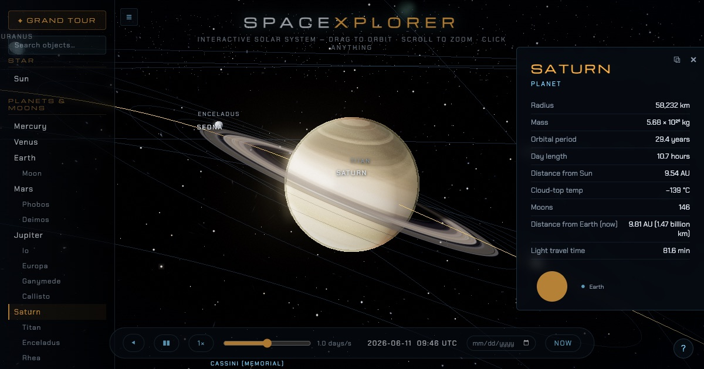

# SPACEXPLORER

An interactive 3D solar system explorer. No build step — plain ES modules with
Three.js loaded from a CDN.

**Live:** https://spacexplorer-production.up.railway.app



## Run

```sh
python3 -m http.server 8642
# then open http://localhost:8642
```

(Any static file server works; opening index.html directly does not, because
ES modules require http.)

## What's in it

- **62+ objects on real Keplerian orbits** (J2000 elements) with correct
  periods, axial tilts, and rotation rates — the Sun, 8 planets, dwarf
  planets (Pluto, Ceres, Eris, Makemake, Haumea, Sedna…), 16 moons, named
  asteroids (Vesta, Pallas, Bennu, Apophis), comets (Halley, 67P, NEOWISE),
  and man-made craft: ISS, Tiangong, Hubble, JWST at L2, rovers on Mars,
  the Tesla Roadster, Voyagers, Pioneers, New Horizons, and a 700-satellite
  Starlink shell. Distances/radii are power-law compressed so everything
  fits on screen (a true-scale mode is one toggle away).
- **Live celestial mechanics:** moon transit shadows sweep across Jupiter
  and Saturn; moons go dark in their planet's shadow (Rømer's eclipses);
  Earth↔Moon eclipses; ring shadows both ways; Pluto–Charon wobble around
  their barycenter; Venus's cloud deck super-rotates; Triton orbits
  backwards; everything tidally locked that should be.
- **AAA-leaning graphics:** HDR bloom + ACES tone mapping + film grain &
  vignette, animated sun with limb darkening and a chromosphere rim,
  atmospheric scattering with sunset terminators on seven worlds, terrain
  bump relief, procedural identities for the famous moons (Io's volcanoes,
  Europa's lineae, Iapetus's yin-yang, Enceladus's geysers, Charon's
  Mordor Macula), lumpy asteroids and coal-dark comet nuclei, IBL-lit PBR
  spacecraft miniatures, nebula accents and a twinkling 7,000-star field.
- **Time machine:** pause, reverse, 0.01–100 days/s, real-time 1×, a date
  picker (watch Halley swing by in 1986), and NOW. Space bar = play/pause.
- **Grand Tour:** a 21-stop guided autoplay with cinematic camera drift.
- **Shareable:** `?focus=` + `?date=` deep links, a copy-link button, and a
  social preview card. Procedural WebAudio ambience (toggleable).
- Accessible (aria-labels, prefers-reduced-motion) and resilient (WebGL
  fallback message, progressive 8K textures, tinted fallback on texture
  failure).

## Test

```sh
npm install   # once (puppeteer-core, drives your installed Chrome)
npm test
```

End-to-end suite in `tests/run-tests.mjs` — 116 assertions: boot, data
integrity for every object, orbital accuracy against known ephemerides,
deterministic-scene pixel regression against committed baselines, shader
and shadow checks, selection/camera/info behavior, search, toggles, time
controls, deep links, tour, mobile viewport, true-scale mode, performance,
and zero console errors.

## Files

- `js/data.js` — all astronomical data, orbital elements, facts, scaling
- `js/bodies.js` — Kepler solver, Sun/planets/moons/comets/belt/starfield
- `js/spacecraft.js` — procedural PBR craft models (ISS, JWST, rovers…)
- `js/ui.js` — navigator, info panel, labels, time controls
- `js/tour.js` — the Grand Tour
- `js/sound.js` — procedural WebAudio ambience
- `js/main.js` — scene, post-processing, camera fly-to/follow, picking
